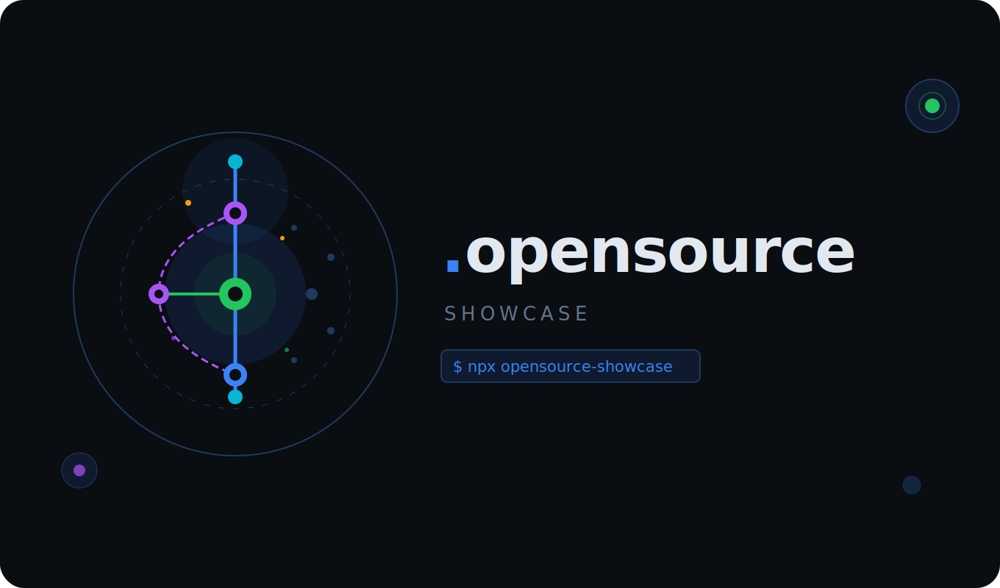

# opensource-showcase

<p align="center">
  
</p>

<p align="center">
  A command-line tool for curating and showcasing open source contributions.
</p>

<p align="center">
  <a href="https://www.npmjs.com/package/opensource-showcase"></a>
  <a href="https://github.com/opensource-showcase/opensource-showcase/blob/main/LICENSE"></a>
  <a href="https://www.npmjs.com/package/opensource-showcase"></a>
</p>

## Overview

opensource-showcase helps developers document their open source work by curating merged pull requests from GitHub and generating a professional portfolio. The tool creates a dedicated `.opensource` repository with a web portfolio, README, and machine-readable contribution data.

## Installation

Run directly without installation:

```bash
npx opensource-showcase
```

Or install globally:

```bash
npm install -g opensource-showcase
```

## Quick Start

1. Run the CLI:

   ```bash
   opensource-showcase
   ```

2. Authenticate with GitHub when prompted. The CLI will open your browser for OAuth authentication.

3. Select repositories and pull requests to showcase.

4. The tool creates a `.opensource` repository in your GitHub account with:
   - `contributions.json` - Machine-readable contribution data
   - `index.html` - Interactive portfolio page
   - `README.md` - Formatted contribution list

5. Optional: install the issue-command workflow so you can add or remove PRs later from a GitHub issue:

   ```bash
   opensource-showcase setup-bot
   ```

   The command creates or updates a `Showcase commands` issue in your `.opensource` repo. Comment there with:

   ```txt
   /showcase add https://github.com/org/repo/pull/123
   showcase remove https://github.com/org/repo/pull/123
   /showcase refresh
   ```

## Features

### Automatic Data Collection

- Fetches all merged pull requests from your GitHub account
- Enriches PRs with repository metadata, descriptions, and reviewer information
- Handles GitHub API pagination and rate limiting

### Intelligent Filtering

- Filters by repository star count
- Excludes trivial changes (typo fixes, dependency updates)
- Removes bot-generated PRs
- Configurable exclusion patterns

### Interactive Selection

- Two-step workflow: select repositories, then select specific PRs
- Visual interface for reviewing contributions
- Ability to add personal notes and impact descriptions

### Professional Output

- GitHub Pages-ready HTML portfolio with search
- Markdown README with organization logos and detailed PR information
- JSON export following the .opensource specification

### Issue Commands

- Add one explicit public merged PR from a comment
- Remove one PR from the showcase
- Refresh metadata for already selected PRs
- GitHub Actions replies with success/failure comments and emoji reactions
- No server or GitHub App required

## Commands

```bash
opensource-showcase              # Interactive mode
opensource-showcase login        # Authenticate with GitHub
opensource-showcase whoami       # Show authenticated user
opensource-showcase status       # Display current contributions
opensource-showcase config       # View or edit configuration
opensource-showcase logout       # Clear authentication
opensource-showcase add <pr-url> # Add one PR from a local .opensource checkout
opensource-showcase remove <pr-url> # Remove one PR from a local .opensource checkout
opensource-showcase refresh      # Refresh already selected PR metadata
opensource-showcase setup-bot    # Install issue-command workflow in .opensource
opensource-showcase --all        # Bypass filtering
opensource-showcase --fresh      # Start from scratch, ignore existing data
```

### Command Options

- `--min-stars=<number>` - Set minimum repository stars (default: 100)
- `--all` - Include all PRs without filtering
- `--fresh` - Ignore existing contributions and start fresh

## Issue Command Workflow

`setup-bot` installs a GitHub Actions workflow in your own `.opensource` repository. It also creates or updates an issue titled `Showcase commands`.

Use comments on that issue to manage the portfolio:

| Command                     | Action                                                                                                   |
| --------------------------- | -------------------------------------------------------------------------------------------------------- |
| `/showcase add <pr-url>`    | Adds one merged public pull request and regenerates `contributions.json`, `README.md`, and `index.html`. |
| `showcase add <pr-url>`     | Same as above, without the slash.                                                                        |
| `/showcase remove <pr-url>` | Removes that pull request from the showcase and regenerates files.                                       |
| `/showcase refresh`         | Re-fetches metadata for PRs already in the showcase. It does not discover or add new PRs.                |

The workflow only accepts commands from repository owners, members, or collaborators. It uses the built-in GitHub Actions `GITHUB_TOKEN`, so users do not need to create a secret.

`refresh` updates metadata such as title, description, stars, language, additions, deletions, changed files, reviewers, and merge data for PRs already stored in `contributions.json`.

## Configuration

Create a configuration file at `~/.opensourcerc`:

```json
{
  "minStars": 100,
  "excludeTitlePatterns": ["chore:", "deps:", "fix typo"],
  "excludeBotPRs": true,
  "excludeOwnRepos": true
}
```

### Configuration Options

| Option                 | Type     | Default    | Description                   |
| ---------------------- | -------- | ---------- | ----------------------------- |
| `minStars`             | number   | 100        | Minimum repository stars      |
| `excludeTitlePatterns` | string[] | See source | PR title patterns to exclude  |
| `excludeBotPRs`        | boolean  | true       | Filter out bot-generated PRs  |
| `excludeOwnRepos`      | boolean  | true       | Exclude your own repositories |

## Output

The tool generates three files in your `.opensource` repository:

### contributions.json

Machine-readable JSON following the [.opensource specification](https://github.com/opensource-showcase/opensource-showcase/blob/main/SPEC.md). Contains complete contribution metadata including:

- Repository information (name, stars, description, language)
- Pull request details (title, URL, merge date, changes)
- Review and approval information
- Custom notes and impact descriptions

### index.html

A static HTML portfolio page with:

- Search functionality across all contributions
- Responsive design
- Rich markdown rendering for PR descriptions
- Reviewer information with avatars

The page is automatically configured for GitHub Pages deployment.

### README.md

A formatted markdown document with:

- Contribution statistics
- Grouped by repository (sorted by stars)
- Organization logos and repository descriptions
- PR details with metadata (date, language, code changes)
- Reviewer information
- Personal impact notes

## GitHub Pages Deployment

The tool attempts to enable GitHub Pages automatically. Your portfolio will be available at:

```
https://<username>.github.io/.opensource/
```

If automatic setup fails, enable it manually:

1. Navigate to `https://github.com/<username>/.opensource/settings/pages`
2. Set source to "Deploy from a branch"
3. Select the `main` branch and `/` (root) folder
4. Click Save

## Authentication

The tool uses GitHub OAuth for authentication. On first run:

1. The CLI generates a device code
2. Opens GitHub in your browser
3. You enter the device code to authorize the application
4. Credentials are stored locally for future use

To refresh authentication:

```bash
opensource-showcase logout
opensource-showcase login
```

## Project Structure

```
src/
├── auth/           # GitHub OAuth implementation
├── commands/       # CLI command handlers
├── filter/         # Contribution filtering logic
├── github/         # GitHub API integration
├── repo/           # Repository and file generation
│   ├── site/       # HTML portfolio generation
│   └── templates/  # README templates
├── types/          # TypeScript type definitions
├── ui/             # Interactive terminal interface
└── utils/          # Shared utilities
```

## Troubleshooting

**No pull requests found:**

- Verify you have merged PRs in public repositories
- Try running with `--all` to see all PRs before filtering
- Check authentication with `opensource-showcase whoami`

**Authentication issues:**

- Run `opensource-showcase logout` to clear credentials
- Run `opensource-showcase login` to re-authenticate

**setup-bot cannot create workflow file:**

- Run `opensource-showcase logout`
- Run `opensource-showcase login`
- Run `opensource-showcase setup-bot`
- The bot setup requires the GitHub OAuth `workflow` scope

**Issue command cannot add a PR:**

- Verify the PR URL is correct
- Verify the PR is merged
- Verify the repository is public
- Private repositories are not supported by the no-server issue-command workflow

## npm README Images

The npm registry can be stricter than GitHub about externally hosted images. Avoid relying on GitHub user-attachment screenshots in this README; badges from stable providers such as Shields.io are used because they render reliably on both GitHub and npm.

**GitHub Pages not working:**

- Verify the repository is public
- Check Pages settings in repository configuration
- Allow up to 10 minutes for initial deployment

## Contributing

Contributions are welcome. Please see [CONTRIBUTING.md](CONTRIBUTING.md) for guidelines.

## License

MIT License. See [LICENSE](LICENSE) for details.

## Support

- Report issues: https://github.com/opensource-showcase/opensource-showcase/issues
- Documentation: https://github.com/opensource-showcase/opensource-showcase
- NPM Package: https://www.npmjs.com/package/opensource-showcase
